## 电子标签检测程序使用说明书

[TOC]

### 前言：

​	<font color='#FF0059' size=5em>需求：帮助维修人员维护编码板代码信息，设计图形化界面，根据配置文件信息，动态擦除摄像头设备的电子标签</font>

<br/>

### 程序所在位置

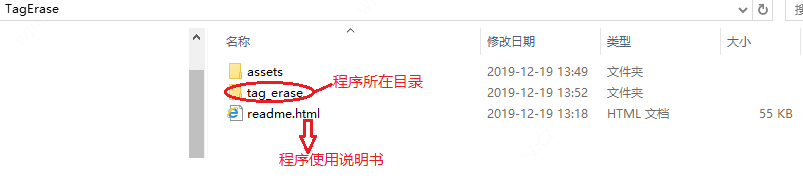

<br>

**打开tag_erase目录找到如下图程序创建桌面快捷方式就可以便捷使用了**


<br/>

### 一、程序主界面

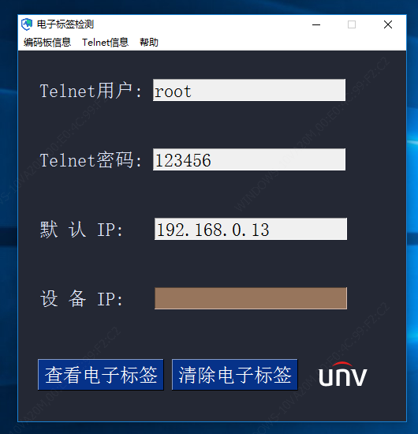

<br/>

### 二、编码板信息功能介绍

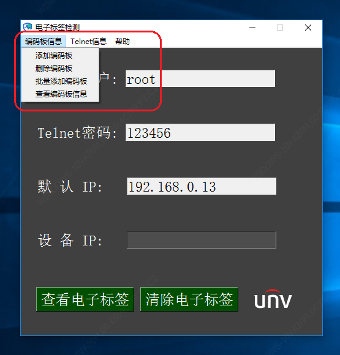


#### 2.1 添加编码板

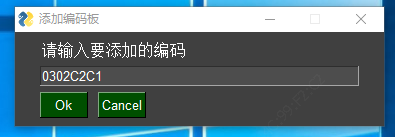

<br/>

**添加需要删除电子标签的编码板到配置文件中，输入的编码大小写都可以，但必须符合编码板的格式<font color='#FF0059'>（0302开头必须是由8位数字加字组成）</font>，否则添加不进去。格式不正确和添加重复的编码都有智能的提示。**


#### 2.2 删除编码板

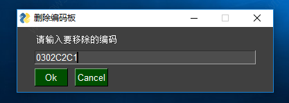

<br/>

**删除配置文件中的某个编码板，格式要求如同添加编码功能一样，都有详细的提示**

**添加和删除编码的功能就达到了动态擦除电子标签的效果**

例如：

配置文件中有 0302C1E4、0302C1E5、0302C1E6 需要擦除电子标签

时间久了0302C1E5不需要擦除电子标签，而0302C2C1编码板需要擦除，我们就可以删除0302C1E5编码，添加0302C2C1编码，此时配置文件就变成0302C1E4、0302C1E6、0302C2C1

<br>

#### 2.3 批量添加编码板

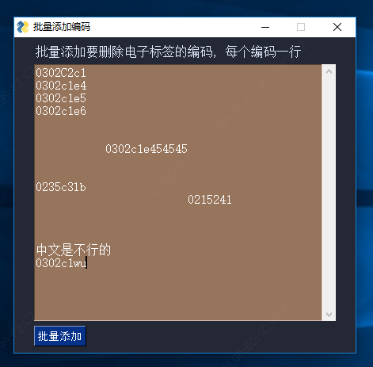

<br/>

如果需要擦除电子标签的编码太多了，用添加编码板功能一个一个添加可以实现但是效率太慢了，因此就可以用批量添加编码到配置文件中。

批量添加的功能比较强大，您可以随意输入，它会自动过滤挑选<font color='#FF0059'>符合格式的、不在配置文件中的</font>，最后会提醒您哪几个编码添加成功。

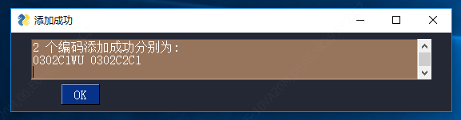

<br/>

#### 2.4 查看编码板信息

无论是添加、删除、批量添加的功能，都是对配置文件动态的修改。

<font color='#FF0059'>查看编码板信息，则是显示配置文件中需要擦除电子标签的编码(5个一行)</font>

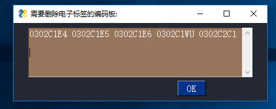

这样您可以知道哪些编码没添加进配置文件中，那些编码是不需要添加进去的(要移除)，到时就可以更清晰的使用添加、删除、批量添加编码板的功能

<font color='red' size=5em>注意:编码不区分大小写，但严格要求编码格式</font>

<br/>

### 三、Telnet信息功能介绍

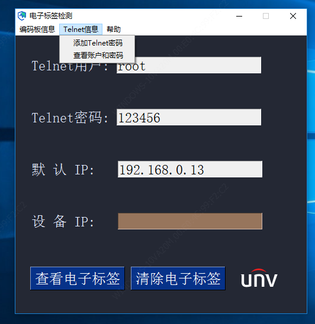

<br/>

#### 3.1添加Telnet密码

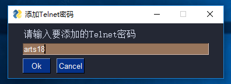

<br/>

登录设备查看、删除电子标签都需要设备的Telnet密码，由于我司一些客户会定制Telnet密码，例如波兰客户定制了<font color='#FF0059' size=4em>arts18</font>密码，因此有添加Telnet密码的功能,防止设备无法登录Telnet查看信息

<br/>

#### 3.2查看账户和密码

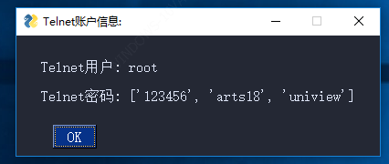

<br/>

用于显示Telnet账户信息

<font color='#FF0059'>注意：主界面只会显示默认的telnet密码，但不用担心，实际登录设备的时候会把配置文件中所有的Telnet密码都尝试登一遍，寻找正确的密码</font>

<br/>

### 四、查看电子标签

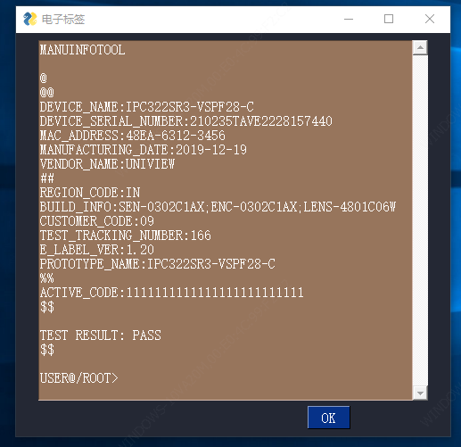

免了登录操作，方便自己确认电子标签是否<font color='#FF0059'>不完整、错误、异常</font>，也可以根据电子标签信息找别人确认疑惑或问题，感觉有内容显示界面让自己更踏实放心

<br>

### <font color='#FF0059'>五、清除电子标签(重点)</font>

**清除电子标签功能是需求主要体现的功能，其他功能都是辅佐它。**

**清除电子标签功能，默认使用<font color='#FF0059'>192.168.0.13 </font>IP 去登录设备,如果有手动输入IP且符合IPv4的合法性则用手动输入的IP登录设备**

**登录成功，它会根据当前上电设备的电子标签中编码板信息与配置文件中的需要删除电子标签的编码信息进行匹对，如果该编码板存在配置文件中，它会清除电子标签，并提示根据XXX编码板删除的，不存在也会提示XXX编码不存在配置文件中**

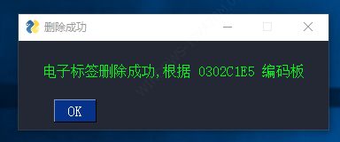

<br/>

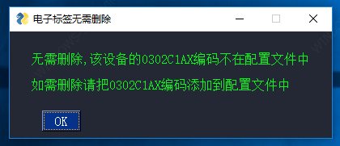

<br/>

**登录失败有提示（但有点小卡顿，因为在等待回显）**

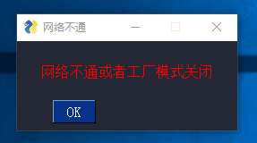

<br/>

**所以一般情况下先确保设备网络通畅，再使用**

<br/>

### 六、帮助

#### 6.1 导出日志

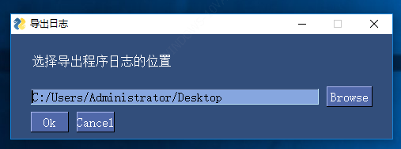

<br/>

<font color='#FF0059'>Browse按钮</font>就是选择日志保存位置,原谅我无法改成中文

以我举例，当前我选择的位置是桌面，点击Ok按钮后，日志文件就会出现在桌面，内容我截取一部分进行分析

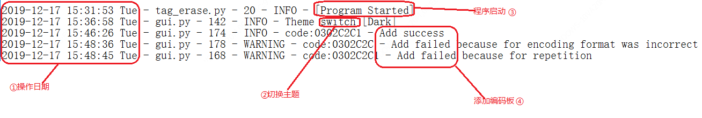

<br/>

一般日志信息都是给专业人员分析，如果您想了解或者分析可以记住以下关键单词

**[Program Started] 程序启动标志**

**[Program Quit]程序关闭标志**

**code、Encode 编码板标志**

**Add 关于添加编码功能的标志**

**Remove 关于移除编码功能的标志**

**Display 关于查看信息功能的标志**

**Theme switch 主题更换的标志**

**...**

<br/>

#### 6.2 更换主题

提供 <font color='#FF0059' size='5em'>3</font> 种主题更换，您可以挑选适合自己的主题，程序会记住您的选择，下次开启会默认显示上次您选择的主题

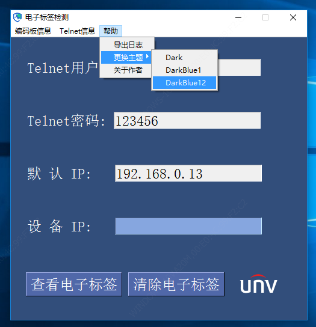

<br/>

#### 6.3 关于作者

显示作者的信息和联系方式

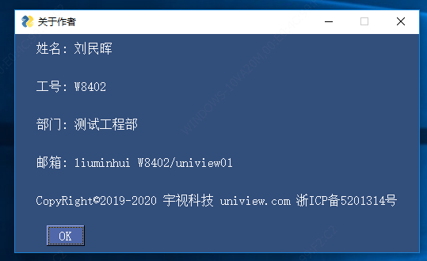

<br/>

### 七、配置文件

恭喜您看到了最后<font color='#FF0059'>(因为大多数人都不喜欢看说明书、协议等)</font>

配置文件的介绍(在config目录下的config.txt)

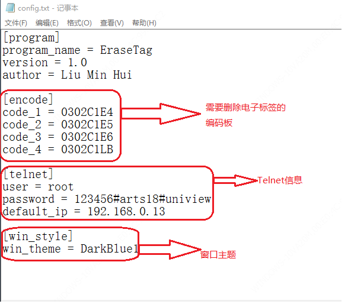

<br/>

**[program]程序信息节点**

<br/>

**[encode]需要删除电子标签的编码板节点**

该程序没有批量删除编码的功能，因此看的懂配置文件的话可以手动修改，但不能重名，例如：

code_4 = 0302C1LB

code_4 = 0302C1SL

code_4就重名，程序将无法正常解析配置文件，会报错闪退

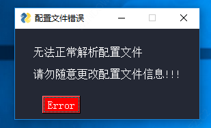

<br/>

**[telnet]telnet信息节点**

里面有默认的telnet用户名，默认登录设备的IP，telnet密码是以#号分隔

程序没有移除telnet密码的功能可以手动配置

默认的telnet用户**<font color='#FF0059'>root</font>**，默认IP常用的**<font color='#FF0059'>192.168.0.13</font>**可能随着时间的推移也会做更改

因此可以手动配置默认的信息，达到程序的通用性

<br/>

**[win_style]窗口样式节点**

窗口主题当前只支持三种程序切换(DarkBlue1、DarkBlue12、 Dark)

介绍的差不多了，更多的功能欢迎大家去程序中挖掘，希望这个小程序可以帮到大家，谢谢。

<font color='red' size=5em>注意：非专业人士，请勿随意修改配置文件信息，否则程序将无法正常运行</font>


**窗口主题手动配置可支持**:

```java
-----------------------------------------------------------------------------------------
                                     窗口主题(138)                                       
-----------------------------------------------------------------------------------------
Black                    BlueMono                 BluePurple               BrightColors             
BrownBlue                Dark                     Dark2                    DarkAmber                
DarkBlack                DarkBlack1               DarkBlue                 DarkBlue1                
DarkBlue10               DarkBlue11               DarkBlue12               DarkBlue13               
DarkBlue14               DarkBlue15               DarkBlue16               DarkBlue17               
DarkBlue2                DarkBlue3                DarkBlue4                DarkBlue5                
DarkBlue6                DarkBlue7                DarkBlue8                DarkBlue9                
DarkBrown                DarkBrown1               DarkBrown2               DarkBrown3               
DarkBrown4               DarkBrown5               DarkBrown6               DarkGreen                
DarkGreen1               DarkGreen2               DarkGreen3               DarkGreen4               
DarkGreen5               DarkGreen6               DarkGrey                 DarkGrey1                
DarkGrey2                DarkGrey3                DarkGrey4                DarkGrey5                
DarkGrey6                DarkGrey7                DarkPurple               DarkPurple1              
DarkPurple2              DarkPurple3              DarkPurple4              DarkPurple5              
DarkPurple6              DarkRed                  DarkRed1                 DarkRed2                 
DarkTanBlue              DarkTeal                 DarkTeal1                DarkTeal10               
DarkTeal11               DarkTeal12               DarkTeal2                DarkTeal3                
DarkTeal4                DarkTeal5                DarkTeal6                DarkTeal7                
DarkTeal8                DarkTeal9                Default                  Default1                 
DefaultNoMoreNagging     Green                    GreenMono                GreenTan                 
Kayak                    LightBlue                LightBlue1               LightBlue2               
LightBlue3               LightBlue4               LightBlue5               LightBlue6               
LightBlue7               LightBrown               LightBrown1              LightBrown10             
LightBrown11             LightBrown12             LightBrown13             LightBrown2              
LightBrown3              LightBrown4              LightBrown5              LightBrown6              
LightBrown7              LightBrown8              LightBrown9              LightGray1               
LightGreen               LightGreen1              LightGreen10             LightGreen2              
LightGreen3              LightGreen4              LightGreen5              LightGreen6              
LightGreen7              LightGreen8              LightGreen9              LightGrey                
LightGrey1               LightGrey2               LightGrey3               LightGrey4               
LightGrey5               LightGrey6               LightPurple              LightTeal                
LightYellow              Material1                Material2                NeutralBlue              
Purple                   Reddit                   Reds                     SandyBeach               
SystemDefault            SystemDefaultForReal     Tan                      TanBlue                  
TealMono                 Topanga
```

