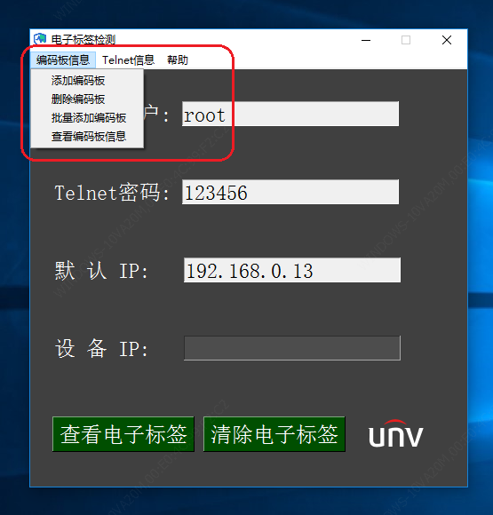
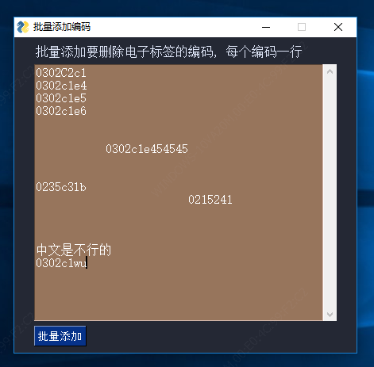
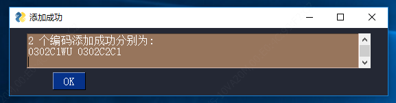
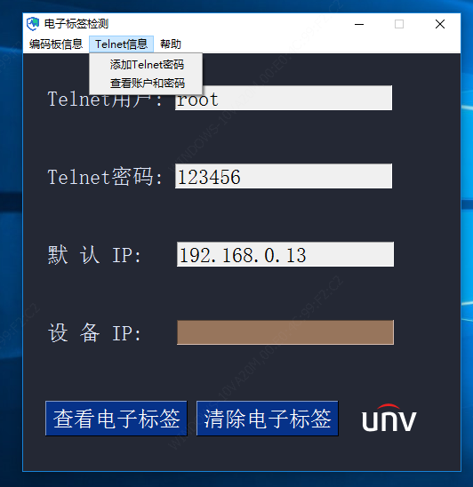
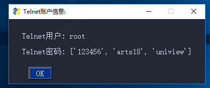
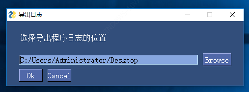

## 程序使用说明书

### 前言：

​	需求：根据配置文件信息，动态擦除设备的电子标签

 

### 一、程序主界面

 

### 二、编码板信息功能介绍

#### 2.1 添加编码板

 

**添加需要删除电子标签的编码板到配置文件中，输入的编码大小写都可以，但必须符合编码板的格式（0302开头必须是由8位数字加字组成），否则添加不进去。格式不正确和添加重复的编码都有智能的提示。**

#### 2.2 删除编码板

 

**删除配置文件中的某个编码板，格式要求如同添加编码功能一样，都有详细的提示**

**添加和删除编码的功能就达到了动态擦除电子标签的效果**

例如：

配置文件中有 0302C1E4、0302C1E5、0302C1E6 需要擦除电子标签

时间久了0302C1E5不需要擦除电子标签，而0302C2C1编码板需要擦除，我们就可以删除0302C1E5编码，添加0302C2C1编码，此时配置文件就变成0302C1E4、0302C1E6、0302C2C1

 

#### 2.3 批量添加编码板

如果需要擦除电子标签的编码太多了，用添加编码板功能一个一个添加可以实现但是效率太慢了，因此就可以用批量添加编码到配置文件中。

批量添加的功能比较强大，您可以随意输入，它会自动过滤挑选符合格式的、不在配置文件中的，最后会提醒您哪几个编码添加成功。

 

#### 2.4 查看编码板信息

无论是添加、删除、批量添加的功能，都是对配置文件动态的修改。

查看编码板信息，则是显示配置文件中需要擦除电子标签的编码(5个一行)

这样您可以知道哪些编码没添加进配置文件中，那些编码是不需要添加进去的(要移除)，到时就可以更清晰的使用添加、删除、批量添加编码板的功能

注意:编码不区分大小写，但严格要求编码格式

 

### 三、Telnet信息功能介绍

 

#### 3.1添加Telnet密码

 

登录设备查看、删除电子标签都需要设备的Telnet密码，由于我司一些客户会定制Telnet密码，例如波兰客户定制了arts18密码，因此有添加Telnet密码的功能,防止设备无法登录Telnet查看信息

#### 3.2查看账户和密码

 

用于显示Telnet账户信息

 

### 四、查看电子标签

 

### 五、清除电子标签

 

### 六、帮助

#### 6.1 导出日志

 

Browse按钮就是选择日志保存位置,原谅我无法改成中文

以我举例，当前我选择的位置是桌面，点击Ok按钮后，日志文件就会出现在桌面，内容我截取一部分进行分析

 

一般日志信息都是给专业人员分析，如果您想了解或者分析可以记住以下关键单词

**[Program Started] 程序启动标志**

**[Program Quit]程序关闭标志**

**code、Encode 编码板标志**

**Add 关于添加编码功能的标志**

**Remove 关于移除编码功能的标志**

**Display 关于查看信息功能的标志**

**Theme switch 主题更换的标志**

**...**

 

#### 6.2 更换主题

提供 3 种主题更换，您可以挑选适合自己的主题，程序会记住您的选择，下次开启会默认显示上次您选择的主题

 

#### 6.3 关于作者

显示作者的信息和联系方式

 